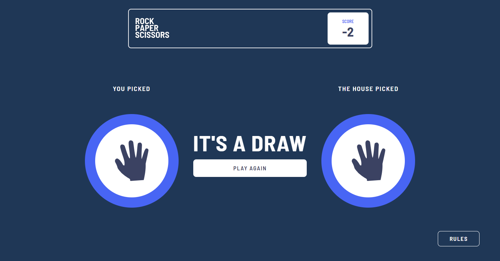

# Frontend Mentor - Rock, Paper, Scissors solution

This is a solution to the [Rock, Paper, Scissors challenge on Frontend Mentor](https://www.frontendmentor.io/challenges/rock-paper-scissors-game-pTgwgvgH). Frontend Mentor challenges help you improve your coding skills by building realistic projects. 

## Table of contents

- [Overview](#overview)
  - [The challenge](#the-challenge)
  - [Screenshot](#screenshot)
  - [Links](#links)
- [My process](#my-process)
  - [Built with](#built-with)
  - [What I learned](#what-i-learned)
  - [Continued development](#continued-development)
  - [Useful resources](#useful-resources)
- [Author](#author)


## Overview

### The challenge

Users should be able to:

- View the optimal layout for the game depending on their device's screen size
- Play Rock, Paper, Scissors against the computer
- Maintain the state of the score after refreshing the browser.

### Screenshot




### Links

- Live Site URL: [Add live site URL here](https://your-live-site-url.com)

## My process

### Built with

- Tailwind CSS
- Vite 
- Flexbox
- CSS Grid
- React Hooks
- Mobile-first workflow
- [React](https://reactjs.org/) - JS library


### What I learned

I reinforced my learning of conditional rendering and further understood how to set items in the local storage and load the stored values in the correct type format needed.I learnt how to use null coalescing and ternary operator in rendering my components.

Some code I am proud of :
```js
<div className='font-bold text-6xl mb-4'>{userWins ? "YOU WIN" : userChoice === compChoice ? "IT'S A DRAW" : "YOU LOSE"}</div>
```

### Continued development

I want to write more projects with the Next Js framework.


### Useful resources

- [W3schools](https://www.w3schools.com/jsref/prop_win_localstorage.asp) - This helped me understand how to navigate local storage. I really liked the straight forward explanation.
- [Mozilla.org](https://developer.mozilla.org/en-US/docs/Web/JavaScript/Reference/Operators/Conditional_operator) - This is an amazing article which helped me finally understand conditional operators.

## Author

- Website - [Megan Kullu](https://https://megankullu.netlify.app/)
- Frontend Mentor - [@MeganKullu](https://www.frontendmentor.io/profile/MeganKullu)
- Twitter - [@megankullu](https://www.twitter.com/megankullu)
